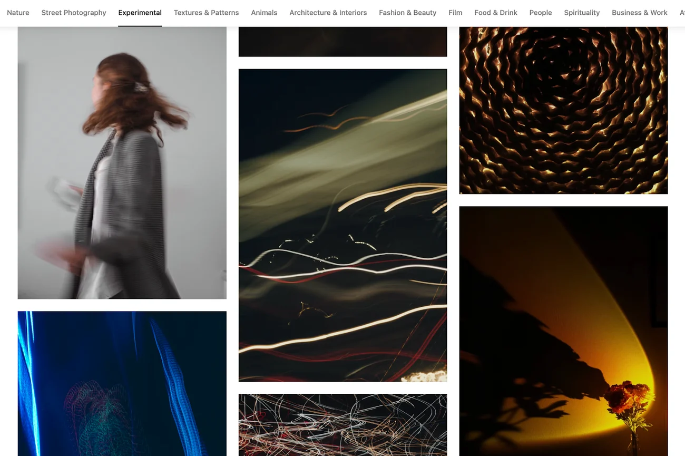

# Online Learning Platform DEMO

This project is a demo project for demonstrating and practicing developing a backend application using Golang.

## Detail

- **Domain**: Image publication system.

Think of it as a simple clone of good-old Instagram.

## Requirement

- Backend system for managing images.
- Users can view/create/update/delete an image.
- Users can set visibility of his/her own image(s).
- Users can view the public images of other users.

## Example UI for ideas

Example UI from [HubSpot's Idea for backend](https://blog.hubspot.com/website/backend-projects#:~:text=Deploy%20an%20Image%20Management%20Application).

Example Dashboard from [ Mohammad Amin Masoudi | Dribbble](https://dribbble.com/shots/18741931-Instagram-Insight-Website).